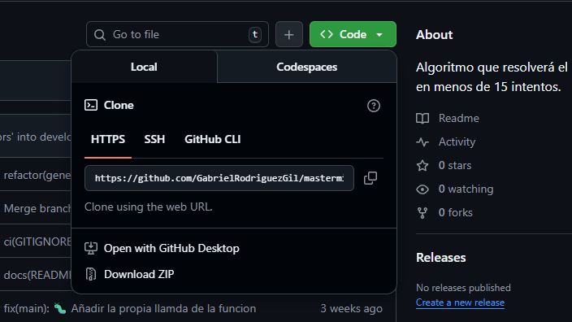
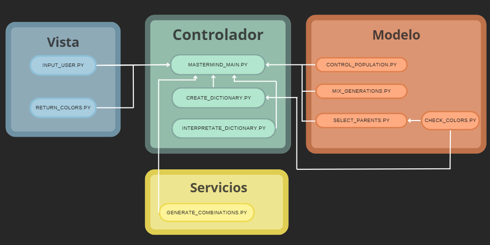

Proyecto de algoritmo genético Mastermind
=========================================

# Indice

- [Introducción](#introducción)
- [Manual](#manual)
    - [Instalación](#instalación) 
    - [Uso](#uso)
- [Metodología](#metodología)
    - [Historias de usuario](#historias-de-usuario)
    - [Arquietectura](#arquietectura)
- [Diseño](#diseño)
    - [Diagrama de componentes](#diagrama-de-componentes)
    - [Herramientas utilizadas](#herramientas-utilizadas)
-[Conclusión](#conclusión)
    - [Posibles mejoras](#posibles-mejoras)
    - [Dificultades](#dificultades)
    - 
# Introducción

El proyecto incluye codigo, para un programa que resuelve el juego de mastermind mediante un algoritmo genético.

Este proyecto esta hecho por:
- Gabriel Rodríguez Gil
- Miguel Gutierrez Pahino

# Manual
## Instalación

1. Descargar el proyecto de GitHub:
    
    

    Descargamos el zip, lo descomprimimos y abrimos la carpeta del proyecto con el editor de codigo que se use.

2. Descargamos las dependencias
    
    Como el proyecto esta configurado con uv, solo tendremos que ejecutar en nuestra terminal del proyecto, "uv sync". Con esto, se creará el entorno virtual y se descargaran las dependencias.

    Para esto necesitaremos **UV**, para instalarlo:

    1. macOS y Linux:

    `curl -LsSf https://astral.sh/uv/install.sh | sh`

    2. Windows (PowerShell):

    `powershell -ExecutionPolicy ByPass -c "irm https://astral.sh/uv/install.ps1 | iex"`

3. Activar el entorno virtual

    Para activar el entorno en Windows usaremos: `.\.venv\Scripts\activate.ps1`

    De otra manera para activar el entorno en Linux usaremos: `source .venv/bin/activate`

## Uso

Para su uso solo hay que abrir el directorio donde se encuentra el proyecto y ejecutar `python main.py`.
Tras ejecutarlo te pedirá una combinación con los colores posibles y te mostrará todos los intento y su puntuación.

# Metodología

La metodología empleada en este caso fue **TDD** , en los módulos que se utilizaban random hemos usado **Property-Based Testing** para controlar si el tipo de resultado que da es el adecuado

También hemos usado **Scrum** como marco de trabajo durante todo el proyecto.

# Descripción técnica
## Not list

| **In Scope** | **Out of Scope** | **Unresolved** |
|--------------|------------------|----------------|
| El jugador elige la combinación de colores de la solución | Pedir el input de una forma más visual  | - |
| Los resultados aparecen de forma gráfica | Usar html y css para representarlos | - |
| Mostrar la evolución del fitness medio con una gráfica| lmostrar una gráfica con la evolución de la población según los colores | - |

## Historias de usuario

Para las historias de usuario hemos usado la herramienta que da GitHub de "Projects" para ver nuestras historias de usuarios y poder planificarlas apropiadamente. 
Las historias de usuarios son las siguientes:

- El jugador uno empieza eligiendo un código de colores para pasarlo por la terminal y que el jugador dos lo resuelva.

- Como jugador quiero ver una representación gráfica de los colores del código para identificar fácilmente cada ficha y entender el estado del juego.

- El jugador dos quiere crear una gran cantidad de posibles respuestas para poder calcular la mejor solución.

- El jugador dos calcula la puntuación del acierto de un intento comparado con la solución para poder luego comparar resultados en un futuro.

- El jugador dos seleccionará una lista de padres de manera estocástica según la probabilidad de ser más cercanos a la respuesta, todo para que puedan tener unos hijos con un resultado más cercano a la respuesta. 

- El jugador dos reproduce a los padres para generar nuevas combinaciones.
  
- El jugador dos crea una nueva generación eliminando de forma estocástica parte de las combinaciones para que la población se pueda parecer más al resultado.

- El jugador uno quiere que el jugador 2 calcule la solución del mastermind.

## Arquietectura

- Modelo: Representa los datos y la lógica central del juego: SecretCode, Attempt, Fitness. Mantiene el estado del juego.
- Vista: Todo lo que el usuario interactúa.
- Controlador: Coordina la interacción entre la vista y el modelo. Recibe inputs del jugador, llama al evaluador, actualiza estado, pide a la vista que muestre resultados.
- Servicios: Funcionalidades auxiliares.

# Diseño
## Diagrama de componentes

## Herramientas utilizadas

- <u>**Python**</u>  
    - **Pytest**: framework de testing utilizado para la creación y ejecución de pruebas unitarias.
    - **Coverage**: herramienta para medir el porcentaje de código cubierto por los tests.
    - **Pytest-sugar**: extensión de Pytest que mejora la visualización de los resultados de los tests en consola.
    - **Colorama**: librería externa utilizada para añadir color y mejorar la salida por consola.
    - **Matplotlib**: librería externa empleada para la visualización de datos y resultados.

- <u>**Markdown**</u>

- <u>**Ruff**</u>

# Conclusión

En este proyecto hemos puesto en práctica todo lo aprendido en Python durante todo el primer trimestre.
Respecto a lo aprendido después de acabar la primera versión, hemos aprendido el funcionamiento de algoritmos genéticos y el funcionamiento de librerias externas como colorama y matplotlib.

## Posibles mejoras

Las principales mejoras que hemos pensado fueron mejorar el apartado gráfico para que sea más agradable de usar.
También nos gustaría mejorar la productividad del código, pensamos que podríamos haber llegado al mismo resultado
con una población inicial no tan grande

## Dificultades

Las dificultades fueron todas a la hora de entender el funcionamiento de los algorítmos genéticos, sobre todo el modulo de crear nuevas familias y como reproducirlas.
También costó la función que calcula el fitness devido a que tenía que comprobar varias características.
